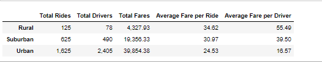
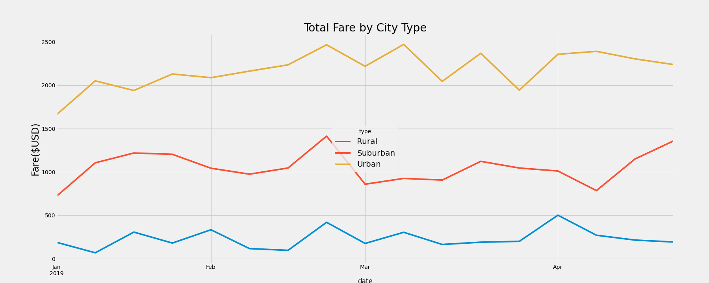

# **PyBer_Analysis**

## **Overview of the analysis**: 
The purpose of the analysis is to identify the differences in ride-sharing data for the 3 city types: Urban, Suburban and Rural in terms of the following:
* Total number of rides / drivers / sum of fares
* Average fare per ride / per driver
* Total fare amount for each date and time
* Sum of the fares for each week

## **Results**: 

* Total rides, total drivers and total fares in Rural Cities are the lowest. Same data in Suburban cities is almost 4.5 to 6.3 times higher than that of the rural data. The city data is exponencially higher than that of the rural data.
* The average fare per ride in rural category is maximum followed by suburban and then urban at $34.62, $30.97 and $24.53 respectively.
* The average fare per driver is extremely high in rural categry followed by suburban and the pretty less in urban category at $55.49, $39.50 and $16.57.

![Weekly_SumOfFares]
(./analysis/weekly_City_Type_Wise_SumOfFares.png)

* The weekly sum of fares follows a similar pattern in all 3 categories, but the value is extrmely low in rural (under$500), extremely high in Urban(between $1500 and $2500), and somewhere in the middle in case of suburban categories(between $700 and $1500).

## **Summary**: 
Business recommendations to the CEO for addressing any disparities among the city types are as follows:
* With just 78 number of total drivers in rural category, there is a need to increase the number of drivers to reach a fair 'average fare per ride' in rural area that people would be able to afford. This would in return also increase the total number of rides and weekly fare in rural categories.
* Health benefits of riding a bike can be propogated via advertisements/banners both in rural and suburban categories.
* People in rural area might need electric bikes in preferance to normal bikes for travelling far distances when compared to suburban and urban categories.
* Alternately more grocery stores / schools / hospital might need to come up within close vicinity of people for both rural and suburban categories.
* Bikes might need to be redesigned to be able to carry more stuff or take care of rough terrain in rural areas. There could be 2-3 types of bikes as per the need of the people.
